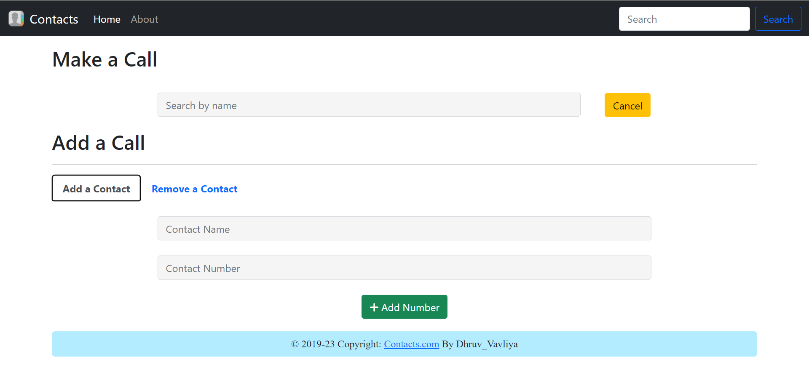

# Contacts
• Contacts is an Optimized Contact List Application. UI designed using HTML ,CSS and JS. Backend optimized using Trie Data Structure. 
• Contacts is a Web Application which allows user to add ,delete and search contacts from Contact-List.   

 
            <h1>Algorithm Analysis</h1>
            

            

                <strong>
                    <pre>
                <h3>Data-Structure : Trie</h3> <h5>Parameters :</h5>
        Number of Contacts     : n
        Average name's length  : s 
        Contact Number's size  : p (generally, takes 8 Bytes)
        Count Attribute's size : c (generally, takes 8 Bytes)
                <h5>Space Complexity Analysis :</h5>
        O(n*(s + p + c))
                <h5>Time Complexity Analysis :</h5>
        Add a Contact           : O(s)
        Delete a Contact        : O(s)
        Check Contact existance : O(s)
        Search a Contact        : O(s*(result set size)) 
                                : Depth First Search(DFS) on prefix match.
        
note : All the Complexities are based on "Average Case Scenario".
                </pre>
                </strong>
